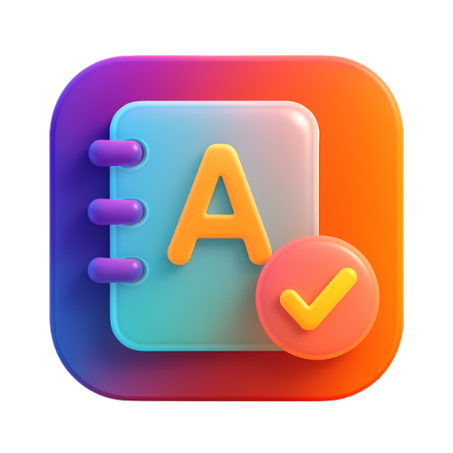

# Vocab Saver Extension

Tiện ích mở rộng Chrome giúp lưu từ vựng trong khi lướt web, với giao diện đẹp mắt lấy cảm hứng từ Quizlet và khả năng tổ chức từ vựng theo danh mục.



## Tính năng

- **Thu thập từ vựng dễ dàng:** Lưu từ vựng và cụm từ từ bất kỳ trang web nào chỉ với vài cú nhấp chuột
- **Giao diện đẹp mắt:** UI hiện đại, sạch sẽ với cả chế độ sáng và tối lấy cảm hứng từ Quizlet
- **Nhiều phương pháp lưu từ vựng:**
  - Nhấp chuột phải vào văn bản đã chọn và chọn "Lưu từ vựng"
  - Sử dụng phím tắt (Ctrl+Shift+S hoặc Command+Shift+S)
  - Double-click vào từ và sử dụng popup lưu nhanh
- **Phát âm tích hợp:** Nghe cách phát âm của từ với nhiều nguồn âm thanh
- **Tổ chức thông minh:** Phân loại từ vựng với các danh mục tùy chỉnh
- **Khả năng xuất dữ liệu:** Xuất danh sách từ vựng dưới dạng file CSV hoặc TXT
- **Tích hợp dịch thuật:** Hỗ trợ dịch tự động (yêu cầu cấu hình API)
- **Bảo mật tốt:** Tất cả dữ liệu từ vựng được lưu trữ cục bộ trong trình duyệt của bạn

## Cài đặt

### Từ Chrome Web Store (Coming Soon)
1. Truy cập trang [Vocab Saver Extension](https://chrome.google.com/webstore/detail/vocab-saver/your-extension-id) trên Chrome Web Store
2. Nhấp "Thêm vào Chrome"
3. Xác nhận cài đặt

### Cài đặt thủ công (Chế độ nhà phát triển)
1. Tải xuống hoặc clone repository này
2. Mở Chrome và truy cập `chrome://extensions/`
3. Bật "Developer mode" (Chế độ nhà phát triển) ở góc trên bên phải
4. Nhấp "Load unpacked" (Tải giải nén) và chọn thư mục tiện ích
5. Tiện ích đã được cài đặt và sẵn sàng sử dụng

## Hướng dẫn sử dụng

### Lưu từ vựng

**Cách 1: Menu ngữ cảnh**
1. Chọn một từ hoặc cụm từ trên bất kỳ trang web nào
2. Nhấp chuột phải và chọn "Lưu từ vựng: [văn bản đã chọn]"
3. Một popup sẽ xuất hiện để bạn thêm ý nghĩa và chọn danh mục
4. Nhấp "Lưu" để thêm từ vào bộ sưu tập của bạn

**Cách 2: Chọn nhanh**
1. Double-click vào một từ trên bất kỳ trang web nào
2. Một nút popup nhỏ sẽ xuất hiện gần vùng chọn
3. Nhấp vào nút để mở popup lưu từ vựng

**Cách 3: Phím tắt**
1. Chọn văn bản trên bất kỳ trang web nào
2. Nhấn Ctrl+Shift+S (Windows/Linux) hoặc Command+Shift+S (Mac)
3. Popup lưu từ vựng sẽ xuất hiện

### Quản lý từ vựng

**Truy cập từ vựng của bạn**
1. Nhấp vào biểu tượng Vocab Saver trên thanh công cụ trình duyệt
2. Duyệt qua các từ đã lưu gần đây trong popup
3. Nhấp "Mở trình quản lý từ vựng" để truy cập giao diện quản lý đầy đủ

**Trong trình quản lý từ vựng**
- **Xem từ vựng:** Duyệt tất cả từ vựng đã lưu
- **Lọc:** Lọc từ theo danh mục hoặc tìm kiếm các từ cụ thể
- **Chỉnh sửa:** Sửa đổi ý nghĩa hoặc xóa các mục không mong muốn
- **Danh mục:** Tạo, chỉnh sửa và xóa danh mục
- **Xuất:** Xuất từ vựng dưới dạng file CSV hoặc TXT

### Sử dụng tính năng phát âm

1. Nhấp vào biểu tượng loa bên cạnh bất kỳ từ nào để nghe cách phát âm
2. Phát âm được lấy từ:
   - Free Dictionary API (nguồn chính)
   - Google Text-to-Speech (dự phòng)
   - Browser Speech Synthesis (thay thế cuối cùng)

### Tính năng dịch thuật

Để dịch tự động khi lưu từ:
1. Mở trình quản lý từ vựng
2. Đi đến Cài đặt > Cấu hình API
3. Chọn dịch vụ dịch thuật và cấu hình API key của bạn
4. Dịch thuật sẽ khả dụng khi lưu từ mới

### Chế độ Sáng/Tối

- Chuyển đổi giữa chế độ sáng và tối bằng cách sử dụng nút chuyển đổi chủ đề trong giao diện
- Tùy chọn của bạn được lưu tự động

## Cấu hình API (Tùy chọn)

Tiện ích hỗ trợ các dịch vụ dịch thuật sau:
- OpenAI
- Google Gemini
- DeepSeek
- Grok

Để cấu hình:
1. Lấy API key từ dịch vụ bạn chọn
2. Nhập API key vào phần Cài đặt > Cấu hình API
3. Kiểm tra kết nối trước khi lưu

## Quyền riêng tư

- Tất cả dữ liệu từ vựng được lưu trữ cục bộ trong trình duyệt của bạn
- Không có dữ liệu nào được gửi đến máy chủ bên ngoài (ngoại trừ yêu cầu dịch nếu được cấu hình)
- API key được lưu trữ an toàn trong bộ nhớ cục bộ của trình duyệt

## Phát triển

```bash
# Cài đặt dependencies
npm install

# Chạy trong chế độ phát triển
npm run dev

# Build cho sản phẩm
npm run build
```

## Giấy phép

[MIT License](LICENSE)

## Hỗ trợ

Nếu bạn gặp bất kỳ vấn đề hoặc có đề xuất, vui lòng [mở một issue](https://github.com/yourusername/vocab-saver/issues) trên GitHub.

---

Được tạo với ❤️ dành cho những người học ngôn ngữ ở khắp mọi nơi.
